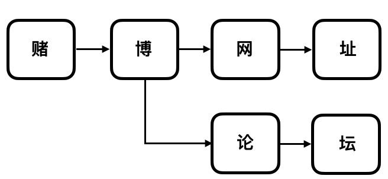

# 敏感词过滤

基于`DFA`算法, 用 `Ruby` 实现敏感词过滤，具备以下功能
- 支持加载系统自带敏感词通用库（广告，政治，色情等等）
- 支持导入敏感词文件
- 支持添加单个敏感词
- 敏感词检查输出

## 安装

`Gemfile` 文件增加下面一行：

```ruby
gem 'sensitive'
```

然后执行：

    $ bundle install

或者手工安装：

    $ gem install sensitive

## 使用方法

#### 选择是否加载 `Gem` 自带敏感词库

`Gem` 里面提供了 **一万多条** 敏感词，涉及
- 广告
- 政治
- 色情
- 其它

你可以根据自己选择是否加载，加载方法：

```ruby
Sensitive.load_default
```

#### 加载自己的敏感词文件 

你也可以加载自己的一个或多个敏感词文件，文件格式支持 `txt`， 不同的敏感词条独立一行

```ruby
Sensitive.load_file(file_path)
```

#### 动态添加单个敏感词

```ruby
Sensitive.add_word('赌博')
```

#### 清空敏感词

```ruby
Sensitive.empty!
```

#### 敏感词过滤

```ruby
# filter 方法传入需要检测的敏感字符串,如果字符串中有敏感词，则返回，如果没有，则返回空
Sensitive.filter('不要赌博') #=> '赌博'
```

```ruby
irb(main):018:0> puts Sensitive.words
{}
irb(main):019:0> Sensitive.add_word('敏感词')
=> ["敏", "感", "词"]
irb(main):020:0> puts Sensitive.words
{"敏"=>{:is_end=>false, :value=>{"感"=>{:is_end=>false, :value=>{"词"=>{:is_end=>true, :value=>{}}}}}}}
irb(main):021:0> puts Sensitive.filter('检测敏感词的算法')
敏感词
irb(main):022:0> puts Sensitive.filter('色情信息')
irb(main):023:0> Sensitive.load_default
irb(main):024:0> puts Sensitive.filter('色情信息')
色情信息
irb(main):025:0> Sensitive.empty
=> {}
irb(main):026:0> puts Sensitive.words
{}
```

## DFA 算法
`Gem` 中，用 `ruby`实现了 `DFA` 算法
> DFA（Deterministic Finite Automaton,即确定有穷自动机。其原理为：有一个有限状态集合和一些从一个状态通向另一个状态的边，每条边上标记有一个符号，其中一个状态是初态，某些状态是终态。但不同于不确定的有限自动机，DFA中不会有从同一状态出发的两条边标志有相同的符号。

因此，`DFA` 算法非常适合用来做敏感词过滤

#### DFA算法解析
假如敏感词库里有：**赌博网站** 和 **赌博论坛**  这两个敏感词，首先我们要建立一个以下的结构



Ruby 算法会生成以下一棵如下内容的 `hash` 树
```ruby
{
  "赌"=>{
    :is_end=>false, 
    :value=>{
      "博"=>{
        :is_end=>false, 
        :value=> {
          "网"=>{
            :is_end=>false,
            :value=>{
              "站"=>{
                :is_end=>true,
                :value=>{}
              }
            }
          },
          "论"=>{
            :is_end=>false,
            :value=>{
              "坛"=>{
                :is_end=>true,
                :value=>{}
              }
            }
          }
        }
      }
    }
  }
}
```

#### `DFA` 运行逻辑：

比如检测敏感词 '赌博网站'

首先切割成一个个字： 赌、博、网、站

程序拿着 '赌' 为 `hash key` 在 `DFA hash` 树中查询，如果有就返回 '赌' 下面的子树，无则不是敏感词

接上面子树, 匹配第二个字 '博'，有就返回 '博' 下面的子树，无则不是敏感词。以此类推...

最终 `is_end = true`，表明敏感词搜索结束

## License

[MIT License](https://opensource.org/licenses/MIT).

